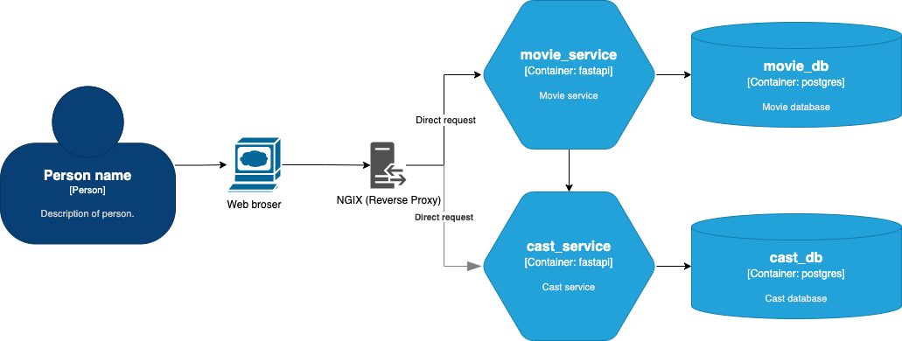

# python-microservice-fastapi

Learn to build your own microservice using Python and FastAPI. Please refer to this articel [Microservice in Python using FastAPI](https://dev.to/paurakhsharma/microservice-in-python-using-fastapi-24cc).



The system contains 4 main services (`movie_service`, `movie_db`, `cast_service`, `cast_db`) and `nginx`. `movie_service` and `cast_service` services provide APIs for users/clients to indirectly get/use resources from databases.

The `cast_service` provides APIs to CR a group of actors of a particular movie.

The `movie_service` provides APIs to CRUD movie. This service will make a call (`is_cast_present(cast_id: int)`) to the `cast_service` to check actors are present in the `cast_db`.

`nginx` acts as just a reverse proxy direct the request by adding a middleware which routes our requests to different services (ports for an example) based on the API URL. So instead of access to `http://${HOST_IP}:8001/docs `, we access to `http://${HOST_IP}:8080/api/v1/movies/docs`.

## How to run??

 - Make sure you have installed `docker` and `docker-compose`
 - Run `docker-compose up -d`
 - Head over to http://${HOST_IP}:8080/api/v1/movies/docs for movie service docs 
   and http://${HOST_IP}:8080/api/v1/casts/docs for cast service docs

## Errors and Solutions

### Bad gateway nginx

```bash
$ docker compose -p pyms up -d
$ docker compose -p pyms logs -f
```

You see that both `movie_service` and `cast_service` cannot connect to its corresponding db.

`
pyms-movie_service-1  | sqlalchemy.exc.OperationalError: (psycopg2.OperationalError) connection to server at "movie_db" (172.27.0.3), port 5432 failed: Connection refused
pyms-movie_service-1  |         Is the server running on that host and accepting TCP/IP connections?
pyms-cast_service-1   |     conn = _connect(dsn, connection_factory=connection_factory, **kwasync)
pyms-cast_service-1   | sqlalchemy.exc.OperationalError: (psycopg2.OperationalError) connection to server at "cast_db" (172.27.0.2), port 5432 failed: Connection refused
pyms-cast_service-1   |         Is the server running on that host and accepting TCP/IP connections?
`

And if you check logs of either db, you will see db has been shutdown then restarted, that's why other services cannot connect to it in the shutdown and restart period. The solution is you should restart other servicesl

`
/usr/local/bin/docker-entrypoint.sh: ignoring /docker-entrypoint-initdb.d/*
...
2024-09-16 01:42:43.686 UTC [45] LOG:  database system was shutdown at 2024-09-16 01:42:43 UTC
2024-09-16 01:42:43.703 UTC [1] LOG:  database system is ready to accept connections
`

```bash
$ docker compose -p pyms restart movie_service cast_service
```
